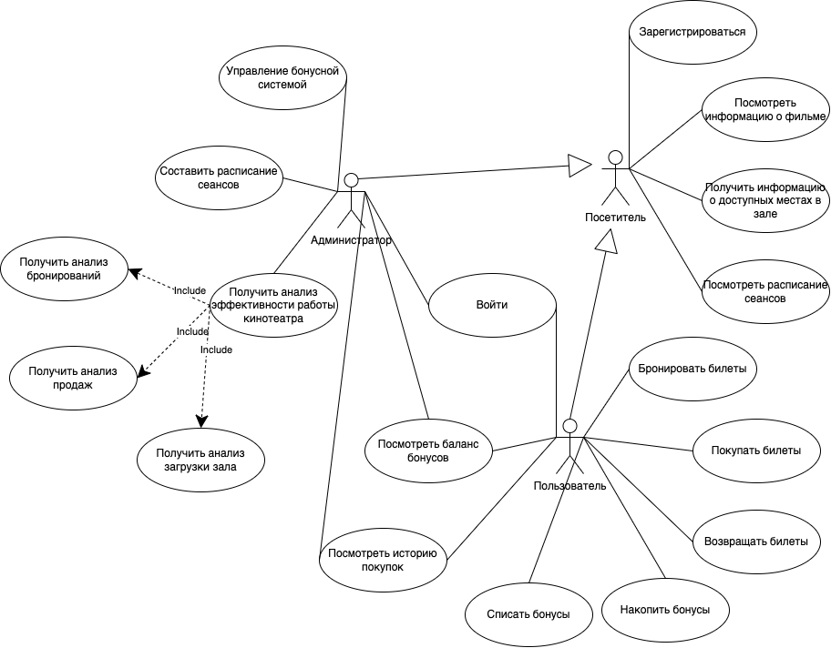

# PPO
# Приложение для сети кинотеатров  

## Краткое описание идеи проекта

Приложение для сети кинотеатров, позволяющее управлять бронированием билетов и анализировать ключевые показатели работы кинотеатров. 
Пользователям предоставляются возможности поиска фильмов, выбора сеансов и покупки билетов, а администраторам – мониторинг продаж, загрузки залов и других аналитических данных. 

## Краткое описание предметной области

Автоматизированные платформы позволяют зрителям выбирать фильмы, бронировать места онлайн, а администраторам — получать статистические данные о доходности, посещаемости и загрузке залов, эффективности работы персонала и лояльности клиентов. Такие системы повышают удобство для посетителей и помогают повысить эффективность работы сети кинотеатров.

## Краткий анализ аналогичных решений

|Функция | UCS-Премьера | Cinemabox | Домино | TicketSoft | WellSeen |
|-|-|-|-|-|-|
| Онлайн-бронирование билетов | + | + | + | + | + |
| Поиск фильмов | + | + | + | + | + |
| Аналитика продаж и загрузки залов для администраторов | + | + | + | + | + |
| Персонализированные рекомендации фильмов | - | - | - | - | + |
| Система бонусов для пользователей | - | - | - | - | + |

## Краткое обоснование целесообразности и актуальности проекта

Приложение актуально для повышения лояльности зрителей через персонализированные рекомендации и бонусную систему. Администраторам предоставлены необходимые инструменты для анализа эффективности работы кинотеатров.

## Краткое описание акторов

1. Посетитель  – незарегистрированный пользователь, который может просматривать расписание сеансов, информацию о фильмах и доступные места в зале.
    
2. Пользователь  – зарегистрированный пользователь, который может искать фильмы, бронировать и покупать билеты, просматривать свою историю заказов и накапливать бонусы.
    
3. Администратор – сотрудник, управляющий расписанием сеансов, анализирующий бронирование, загрузку залов, продажи и посещаемость.

## Use-Case - диаграмма

## ER-диаграмма сущностей

## Пользовательские сценарии

### Посетитель
Незарегистрированный пользователь может зарегистрироваться или посмотреть расписание сеансов, информацию о фильмах и доступные места в зале без регистрации. 

### Пользователь
Зарегистрированный пользователь может войти в программу, введя логин и пароль, посмотреть расписание сеансов, информацию о фильмах и доступные места в зале. Пользователь может забронировать, купить билет, отменить бронь при наличии, вернуть билет при наличии. При покупке билета пользователю начисляются бонусы, он может их списать. Пользователь может просмотреть свою историю покупок и баланс бонусов, получить персонализированные рекомендации фильма. 

### Администратор
Зарегистрированный пользователь может войти в программу как администратор, введя логин и пароль, посмотреть расписание сеансов, информацию о фильмах и доступные места в зале. Администратор может начислить/списать бонусы пользователя, составить расписание сеансов, получить анализ эффективность работы кинотеатра (количество бронирований/отмен брони, количество продаж/покупок билетов, анализ загрузки зала).
 
