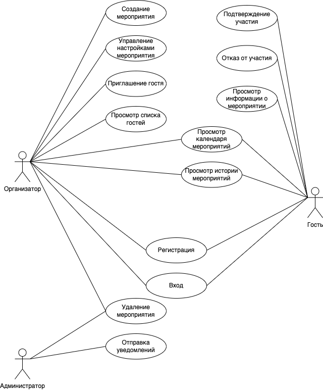
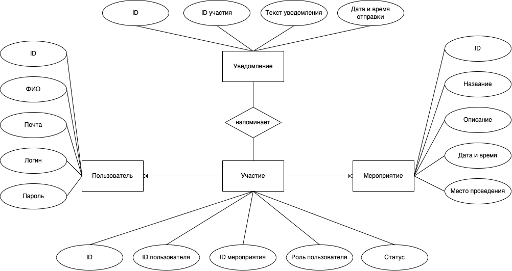
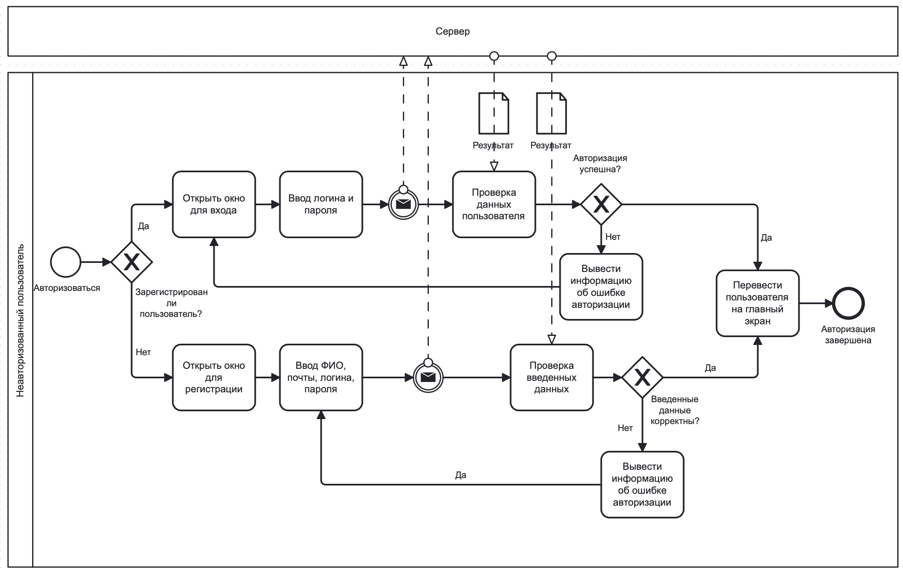
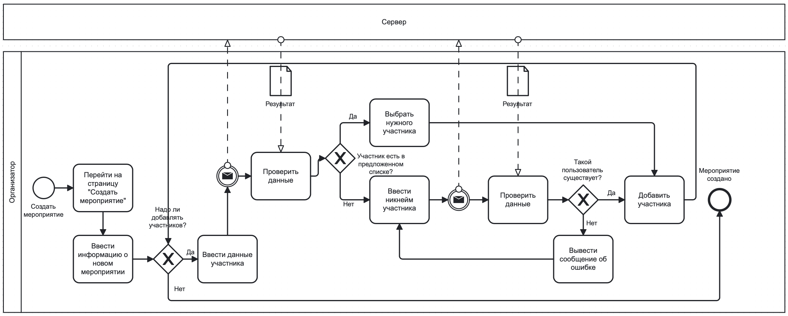
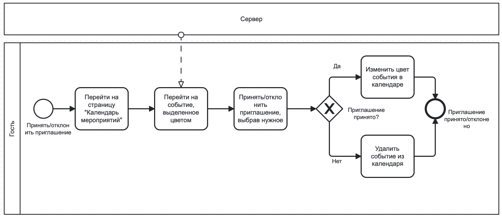
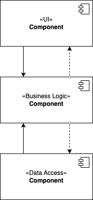
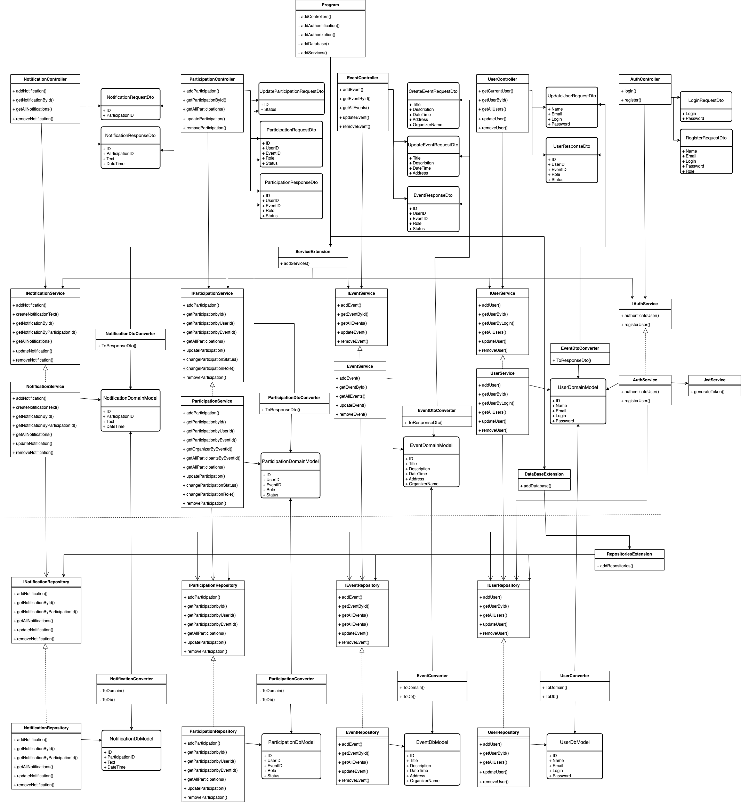
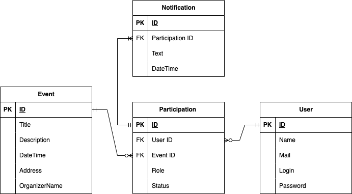

# Приложение для управления событиями

## Краткое описание идеи проекта

Веб-приложение для создания и управления событиями, такими как встречи, вечеринки или конференции. Пользователи могут создавать события, приглашать участников и отслеживать их подтверждения. Приложение также отправляет автоматические напоминания о предстоящих событиях и позволяет ограничивать количество участников.

## Краткое описание предметной области

Предметная область проекта – управление событиями и взаимодействие между организаторами и участниками. Приложение охватывает процессы создания событий, приглашения участников, подтверждения участия и уведомления о предстоящих мероприятиях. Это упрощает и ускоряет организацию мероприятий.

## Краткий анализ аналогичных решений

| Функция                                      | Google Календарь | Eventbrite | Meetup | Eventify |
|----------------------------------------------|------------------|------------|--------|----------|
| Создание событий                             | +                | +          | +      | +        |
| Приглашение участников                       | +                | +          | +      | +        |
| Календарь событий                            | +                | +          | +      | +        |
| Система уведомлений                          | +                | +          | +      | +        |
| Отслеживание подтверждений                   | -                | +          | +      | +        |
| История мероприятий со списком участников    | -                | -          | -      | +        |

## Краткое обоснование целесообразности и актуальности проекта

Существующие решения ориентированы в основном либо на продажу билетов на масштабные мероприятия, либо на поиск и участие в мероприятиях, организованных незнакомыми людьми или группами по интересам. Приложение Eventify актуально, так как упрощает процесс организации мероприятий с отслеживанием подтверждений и управлением списком приглашенных гостей.

## Краткое описание акторов

1.  Организатор  – пользователь, который создает события, приглашает гостей и управляет настройками события.
    
2.  Участник – пользователь, который получает приглашения на события, подтверждает участие и получает уведомления.
    
3.  Администратор – техническая роль, отвечающая за управление пользователями и поддержку системы.

## Use-Case - диаграмма

## ER-диаграмма сущностей

## Пользовательские сценарии

### Организатор
Организатор создает мероприятие и отправляет приглашения.
1. Организатор входит в систему, вводя свои логин и пароль.
2. Организатор переходит в раздел "Создать мероприятие", заполняет данные о мероприятии.
3. Организатор нажимает кнопку "Создать".
4. После создания мероприятия организатор переходит в раздел "Участники", выбирает пользователей из списка или вводит их почту для приглашения.
5. Организатор нажимает кнопку "Отправить приглашения".

### Участник
Участник получает приглашение и отвечает на него.
1. Участник получает уведомление о новом приглашении на мероприятие.
2. Участник переходит в календарь мероприятий.
3. Участник нажимает на выделенное цветом новое мероприятие, выбирает "Принять"/"Отклонить", цвет события в календаре меняется в зависимости от ответа участника.

### Администратор
Администратор отправляет напоминание о предстоящем мероприятии.
1. Администратор проверяет список предстоящих мероприятий.
2. Администратор формирует список участников, которые приняли приглашение.
3. Создаётся уведомление о предстоящем мероприятии, содержащее информацию о нём.
4. Уведомления отправляются всем участникам из списка.

## Формализация ключевых бизнес-процессов

## Описание типа приложения и технологического стека

**Тип приложения:** Desktop; 
**Backend:** С#, .Net 8.0 , Entity Framework Core
**Frontend:** Avalonia 
**СУБД:** PostgreSQL + PgAdmin4 
Взаимодействие между серверной и клиентской частями осуществляется через REST API.

## Верхнеуровневое разбиение на компоненты

1.  Компонент реазации UI.
2.  Компонент бизнес-логики.
3.  Компонент доступа к данным.
   

## UML диаграмма классов

## Диаграмма базы данных

